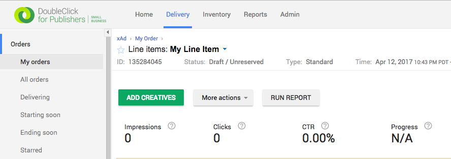

# GroundTruth Display SDK - Android

## Table of Contents

[Overview](#user-content-overview)

[Integration](#user-content-integration)

Stand Alone
* [Banner](#user-content-stand-alone-banner)
* [Interstitial](#user-content-stand-alone-interstitial)
* [Video](#user-content-stand-alone-video)

Mediation Networks
* [DFP](#user-content-dfp)
* [AdMob](#user-content-admob)
* [MoPub](#user-content-mopub)

<a name="overview"></a>
## Overview

The GroundTruth advertising network is powered by patented Location Verification and Blueprints™ technologies. These technologies help us detect quality user location signals that drive the delivery of high-performance ad inventory to the right user at the right time for the purpose of monetizing your Mobile App.

Mobile App publishers can access this ad inventory with the GroundTruth Display SDK. The GroundTruth Display SDK is designed to be embedded within a Mobile App. It provides the necessary modules to serve and render ads and support popular mediation networks.

This guide contains information on how to integrate your application with the GroundTruth Display SDK. It is also designed to work with popular GroundTruth mediation frameworks, namely DFP, Admob, and Mopub.

### Capabilities

* Support for Standard Banner Ads
* Support for Interstitial Ads
* Support for MRAID v2.0 (Mobile Rich Media Ad Interface Definition)
* Support for VAST v2.0 Linear (Video Ad Serving Template)
* Mediation support to fall back on the following ad networks:
  * DFP
  * Admob
  * Mopub

### Requirements

* Android API 19-25
* Publisher key provided by GroundTruth

### Data Collection

The Display SDK requires the most accurate information possible to deliver the right ad to the user. Some information is collected automatically, while other information is passed in by the application. 

#### 1) Automatically collected data

* User Agent
* Location (when available)
  * Latitude
  * Longitude
  * Altitude
  * Horizontal accuracy
* Device ID
* IP address 
* Application info
  * Name
  * Bundle
  * Version
* Device info
  * Language
  * Operating system
  * Operating system version

#### 2) Application provided data

To prevent advertising specific products or services inside the App, the GroundTruth Display SDK supports blocking per `RTB` specification.

* Blocked Categories (you can block categories of advertisers by providing a comma-delimited list of IAB codes or the products or services or companies)
* Blocked Advertisers (you can block advertisers by providing a comma-delimited list of top level domain)

You should provide a form to collect the following information:

* Gender
* Age - We do not deliver any ads to users 13 years old or younger, nor do we deliver any alcohol ads to users unless they are 21+
* Location - Alternative location information when you the publisher refuse to enable GPS location acquisition. You can choose to send the user’s zip code, the city along with IP address which gets collected automatically.

##### COPPA Compliance

GroundTruth is COPPA compliant, and as such we do not serve advertisements to children under the age of 13 or those who opt-out using iOS and Android Do-not-track features. Help us by collecting and sending the user age or date of birth.

<a name="integration"></a>
## Integration Instructions

### Step 1 - Request an access key

To make Display SDK work, you will need a designated access key. If your partner manager has not yet supplied this please send an email to sdk@groundtruth.com.

### Step 2 - Import sdk AAR file
In the build.gradle of the whole project, please add following maven url:
```
allprojects {
    repositories {
        jcenter()
        maven {
            url  "https://ground-truth.bintray.com/groundtruth-android-sdk"
        }
    }
}
```

Grab the AAR from Maven Central by adding it as a dependency in your build.gradle file:
```
dependencies {
    ...
    compile 'com.groundtruth.sdk.displaysdk:displaysdk:1.0.+'
    ...
}
```

### Step 3 - Add required activities to `AndroidManifest.xml`

```xml
<activity android:name="com.xad.sdk.vast.activity.VASTActivity"/>
<activity android:name="com.xad.sdk.mraid.VideoPlayerActivity"/>
```

### Step 4 - Ask for location permission
GroundTruth determines the ad that is most relevant and higher performing with location data like geo-coordinates, horizontal accuracy, and IP address.

#### For Android API Level 23 and above
You need to ask location permission while the app is running, not when they install the app. Please refer https://developer.android.com/training/permissions/requesting.html to request permission.

#### For Android API Level 22 and below
You're good to go.

### Step 5 - Choose to use Display SDK as standalone or integrate with DFP/AdMob/MoPub

<a name="stand-alone"></a>
## Option 1 - Standalone

<a name="stand-alone-banner"></a>
### Banner

#### Step 1 - Initialize instance of DisplaySDK
You should initialize DisplaySDK's shared instance before you add any ad(i.e. banner, interstitial or video) on your layout (e.g. initialize it in the `onCreate` method of the activity)
```java
DisplaySdk.sharedInstance().init(this);

```

#### Step 2a - Add the banner view in XML Layout
Insert the following where you wish to place the banner in your activity's layout:

```xml
<com.xad.sdk.BannerView
        xmlns:gt="http://schemas.android.com/apk/res-auto"
        android:layout_width="320dp"
        android:layout_height="50dp"
        android:id="@+id/banner_view"
        gt:AdSize="BANNER"
        gt:AccessKey="your_access_key"
        gt:AdInterval="Long"/>
```

#### Step 2b - Add the banner view programmatically
Alternatively, you can also choose to instantiate and position the view programmatically by adding the following code in the `onCreate` method:
```java
BannerView bannerView = new BannerView(this, AdSize.BANNER, "your_access_key");
```

#### Step 3 - Configure the banner view

```java
public class MainActivity {
    @Override
    protected void onCreate(Bundle savedInstanceState) {
        ...
        // Birthday is April 15, 1988
        AdRequest adRequest = new AdRequest.Builder()
          .setBirthday(1988, AdRequest.ARP, 15)
          .setGender(AdRequest.Gender.MALE)
          .build();
        this.bannerView.setAdRequest(adRequest);
        this.bannerView.setRefresh(RefreshInterval.MEDIUM);
        ...
    }
}
```

#### Step 4 - Set and implement Ad Listener(Only when used as standalone)
To receive event callbacks from the Banner, you must set and implement AdListener.
```java
public class MainActivity {

    @Override
    protected void onCreate(Bundle savedInstanceState) {
        ...
        this.bannerView.setAdListener(new BannerViewListener() {
            @Override
            public void onAdFetchFailed(BannerView bannerView, ErrorCode code) {
                //Called when error occurs and no ad filled in banner view
                if(code == ErrorCode.NO_INVENTORY) {
                    //No ad match for current request
                } else {
                    //Handle other error codes
                    ...
                }
            }

            @Override
            public void onAdClosed(BannerView bannerView) {
                //Called when the user is about to return to the activity after clicking on an ad by clicking close button or back button
            }

            @Override
            public void onAdOpened(BannerView bannerView) {
                //Called when an ad opens an overlay that covers the screen (e.g. landing page or expanded ad).
            }

            @Override
            public void onAdLeftApplication(BannerView bannerView) {
                //Called when an ad leaves the application (e.g. to make a phone call or go to the native browser).
            }

            @Override
            public void onAdLoaded(BannerView bannerView) {
                //Called when an ad is received.
            }
        });
        ...
    }
}
```

#### Step 5 - Request an ad
You will need to call the `loadAd()` method to tell the network layer to request an ad from the server.

```java
this.bannerView.loadAd();
```

### Step 6 - BannerView lifecycle
You should call all lifecycle callbacks(of both bannerView and DisplaySdk) in your activity's lifecycle callbacks as well, as below:
```java
public class MainActivity {

    @Override
    public void onPause() {
        ...
        if (bannerView != null) {
            bannerView.pause();
        }
        DisplaySdk.sharedInstance().pause();
        super.onPause();
        ...
    }

    @Override
    public void onResume() {
        ...
        super.onResume();
        DisplaySdk.sharedInstance().resume();
        if (bannerView != null) {
            bannerView.resume();
        }
        ...
    }

    @Override
    public void onDestroy() {
        ...
        if (bannerView != null) {
            bannerView.destroy();
        }
        DisplaySdk.sharedInstance().destroy();
        super.onDestroy();
        ...
    }
}

```

<a name="stand-alone-interstitial"></a>
### Interstitial Ad

#### Step 1 - Initialize instance of DisplaySDK
You should initialize DisplaySDK's shared instance before you add any ad(i.e. banner, interstitial or video) on your layout (e.g. initialize it in the `onCreate` method of the activity)
```java
DisplaySdk.sharedInstance().init(this);

```

#### Step 2 - Add an interstitial view programmatically
Interstitial ads do not require you to modify the XML layout. You will need to instantiate and position the view programmatically by adding the interstitial to your activity.
```java
InterstitialAd interstitial = new InterstitialAd(this, "your_access_key");
```

#### Step 3 - Configure the interstitial

```java
public class MainActivity {
    @Override
    protected void onCreate(Bundle savedInstanceState) {
        ...
        // Birthday is April 15, 1988
        AdRequest adRequest = new AdRequest.Builder()
          .setBirthday(1988, AdRequest.ARP, 15)
          .setGender(AdRequest.Gender.MALE)
          .build();
        this.interstitial.setAdRequest(adRequest);
        ...
    }
}
```

#### Step 4 - Set and implement Ad Listener(Only when used as standalone)
To receive event callbacks from the interstitial, you must set and implement AdListener.
```java
public class MainActivity {

    @Override
    protected void onCreate(Bundle savedInstanceState) {
        ...
        this.interstitial.setAdListener(new InterstitialAdListener() {
            @Override
            public void onAdLoaded(InterstitialAd interstitialAd) {
                //Called when an ad is received.
            }

            @Override
            public void onAdFetchFailed(InterstitialAd interstitialAd, ErrorCode code) {
                //Called when error occurs and no ad filled in interstitial
                if(code == ErrorCode.NO_INVENTORY) {
                    //No ad match for current request
                } else {
                    //Handle other error codes
                    ...
                }
            }

            @Override
            public void onInterstitialShown(InterstitialAd interstitialAd) {
                //Called after interstitial is showed and overlay the full screen, typically called after interstitial.show() is called
            }

            @Override
            public void onInterstitialFailedToShow(InterstitialAd interstitialAd) {
                //Called after interstitial has been failed to show when calling interstitial.show()
            }

            @Override
            public void onAdClosed(InterstitialAd interstitialAd) {
                //Called when the user is about to return to the activity after clicking close button or back button
            }

            @Override
            public void onAdOpened(InterstitialAd interstitialAd) {
                //Called when an ad opens another overlay that covers the screen (usually is the landing page).
            }

            @Override
            public void onAdLeftApplication(InterstitialAd interstitialAd) {
                //Called when an ad leaves the application (e.g. to make a phone call or go to the native browser).
            }
        });
        ...
    }
}
```

#### Step 5 - Request an ad
You will need to call the `loadAd()` method to tell the network layer to request an ad from the server.

```java
this.interstitial.loadAd();
```

#### Step 6 - Show the interstitial
You will need to call the `show()` method to present the interstitial ad to users. If you want to show the interstitial once it is ready, you can make the call in AdListener's `onAdLoaded(InterstitialAd interstitialAd)` callback, see detail in `Step 3`.

```java
this.interstitial.show();
```

### Step 7 - Interstitial lifecycle
You should call all lifecycle callbacks(of both interstitial and DisplaySdk) in your activity's lifecycle callbacks as well, as below:
```java
public class MainActivity {

    @Override
    public void onPause() {
        ...
        if (interstitial != null) {
            interstitial.pause();
        }
        DisplaySdk.sharedInstance().pause();
        super.onPause();
        ...
    }

    @Override
    public void onResume() {
        ...
        super.onResume();
        DisplaySdk.sharedInstance().resume();
        if (interstitial != null) {
            interstitial.resume();
        }
        ...
    }

    @Override
    public void onDestroy() {
        ...
        if (interstitial != null) {
            interstitial.destroy();
        }
        DisplaySdk.sharedInstance().destroy();
        super.onDestroy();
        ...
    }
}

```

<a name="stand-alone-video"></a>
### Video Ad

#### Step 1 - Initialize instance of DisplaySDK
You should initialize DisplaySDK's shared instance before you add any ad(i.e. banner, interstitial or video) on your layout (e.g. initialize it in the `onCreate` method of the activity)
```java
DisplaySdk.sharedInstance().init(this);

```

#### Step 2 - Add a video ad programmatically
Video ads do not require you to modify the XML layout. You will need to instantiate and position the view programmatically by adding the video ad to your activity.
Note: you should put video min/max durations to indicate the server to return video ad with the proper length.
```java
VideoAd video = new VideoAd(this, 10, 30, "your_access_key");
```

#### Step 3 - Configure the video ad

```java
public class MainActivity {
    @Override
    protected void onCreate(Bundle savedInstanceState) {
        ...
        // Birthday is April 15, 1988
        AdRequest adRequest = new AdRequest.Builder()
          .setBirthday(1988, AdRequest.ARP, 15)
          .setGender(AdRequest.Gender.MALE)
          .build();
        this.video.setAdRequest(adRequest);
        ...
    }
}
```

#### Step 4 - Set and implement Ad Listener(Only when used as standalone)
To receive event callbacks from the video ad, you must set and implement AdListener.
```java
public class MainActivity {

    @Override
    protected void onCreate(Bundle savedInstanceState) {
        ...
        this.video.setAdListener(new VideoAdListener() {
            @Override
            public void onVideoFailedToLoad(VideoAd videoAd, ErrorCode errorCode) {
                //Called when error occurs and no ad filled in video ad
                if(code == ErrorCode.NO_INVENTORY) {
                    //No ad match for current request
                } else {
                    //Handle other error codes
                    ...
                }
            }

            @Override
            public void onVideoStarted(VideoAd videoAd) {
                //Called when the video starts to play
            }

            @Override
            public void onPlaybackError(VideoAd videoAd) {
                //Called when the playback is interrupted or stopped by any errors
            }

            @Override
            public void onVideoClosed(VideoAd videoAd) {
                //Called when user close the video ad by clicking close button or back button
            }

            @Override
            public void onVideoClicked(VideoAd videoAd) {
                //Called when user click anywhere on the video and show the landing page
            }

            @Override
            public void onVideoCompleted(VideoAd videoAd) {
                //Called when playback is completed
            }

            @Override
            public void onVideoLoadSuccess(VideoAd videoAd) {
                //Called when an ad is received.
            }
        });
        ...
    }
}
```

#### Step 5 - Request an ad
You will need to call the `loadAd()` method to tell the network layer to request an ad from the server.

```java
this.video.loadAd();
```

#### Step 6 - Play the video
You will need to call the `play()` method to start to play the ad. If you want to play the ad once it is ready, you can make the call in AdListener's `onVideoLoadSuccess(VideoAd videoAd)` callback, see detail in `Step 3`.

```java
this.video.play();
```

### Step 7 - Video ad lifecycle
You should call all lifecycle callbacks (of both video ad and DisplaySdk) in your activity's lifecycle callbacks as well, as below:
```java
public class MainActivity {

    @Override
    public void onPause() {
        ...
        if (video != null) {
            video.pause();
        }
        DisplaySdk.sharedInstance().pause();
        super.onPause();
        ...
    }

    @Override
    public void onResume() {
        ...
        super.onResume();
        DisplaySdk.sharedInstance().resume();
        if (video != null) {
            video.resume();
        }
        ...
    }

    @Override
    public void onDestroy() {
        ...
        if (video != null) {
            video.destroy();
        }
        DisplaySdk.sharedInstance().destroy();
        super.onDestroy();
        ...
    }
}
```

<a name="dfp"></a>
## Option 2 - DFP

### Step 1 - Import sdk AAR file
In the build.gradle of the whole project, please add following maven url:
```
allprojects {
    repositories {
        jcenter()
        maven {
            url  "https://ground-truth.bintray.com/groundtruth-android-sdk"
        }
    }
}
```

Grab the AAR from Maven Central by adding it as a dependency in your build.gradle file:
```
dependencies {
    ...
    compile 'com.groundtruth.sdk.displaysdk:customeventgooglemobileads:1.0.+'
    ...
}
```

### Config in the `DoubleClick for Publisher` console
### Step 2 - Add GroundTruth as an Ad Network

Under the `Admin` section click `All Companies`.

Click `New Company` and select `Ad network`.


Create a new `Ad network` called `GroundTruth`.


### Step 3 - Create a New Order

Under the `Delivery` tab, select `My Orders` and create a `New Order`.


Set `Advertiser` as GroundTruth in the order.


We recommend that you refer to Googleʼs type and priorities and network documents to better understand how to configure your line items. GroundTruth custom events will be set up as a network line item and it will be in consideration along with AdSense and Ad Exchange.

Make sure you set the type as NETWORK and the end time is set to UNLIMITED to keep this maintain this configuration. Set the bid price in this section with the value that was agreed upon with the GroundTruth team.


Select ad units with the one that you intend to use for the current campaign in the `Add targeting` section.


Configure the rest of the order to your specifications.

### Step 4 - Create a New Creative

Under the line item, click `New Creative`.



Select `SDK Mediation`.


Select `Custom Event` under the `Select Network` drop-down.

Set `Class Name` to `com.xad.sdk.customevent.googlemobileads.CustomEventForDFP` for both banner interstitial ads.

Set `serverParameter` to your GroundTruth access key.

Set `Location Data` to `Active`.


### Step 5 Integrating DFP
https://developers.google.com/mobile-ads-sdk/docs/dfp/android/banner

**Note**: If you are trying to implement Banner View Delegate methods to be notified when an event happens like `onAdLoaded..` or `onAdFailedToLoad..`, you should use `com.google.android.gms.ads.AdListener` instead of using `com.xad.sdk.listeners.BannerViewListener`.

<a name="admob"></a>
## Option 3 - AdMob

### Step 1 - Import sdk AAR file
In the build.gradle of the whole project, please add following maven url:
```
allprojects {
    repositories {
        jcenter()
        maven {
            url  "https://ground-truth.bintray.com/groundtruth-android-sdk"
        }
    }
}
```

Grab the AAR from Maven Central by adding it as a dependency in your build.gradle file:
```
dependencies {
    ...
    compile 'com.groundtruth.sdk.displaysdk:customeventgooglemobileads:1.0.+'
    ...
}
```

### Step 2 - Configure GroundTruth as an Ad Source

Click on `Ad Sources` under `Mediation` to view the ad source editor.


Click `+ New Add Network` to open a list of ad networks.


Click `+ Custom Event` to open the custom event editor.


Set `Class Name` to `com.xad.sdk.customevent.googlemobileads.CustomEventForAdmob` for both banner interstitial ads.

Set `serverParameter` to your GroundTruth access key


Finally, click `Continue` and then `Save` to finalize the addition of GroundTruth as an ad source.


### Step 3 - Configure eCPM prices

Click on the `AdMob Network` and uncheck `Optimize AdMob Network` to allow GroundTruth's custom event to participate in the auction.


Enter the agreed eCPM price, per negotiation with GroundTruth, into the eCPM column.


For this to work, the GroundTruth eCPM should ideally be higher than your default AdMob eCPM.

### Step 4 - Integrating Admob
https://developers.google.com/admob/android/banner

**Note**: If you are trying to implement Banner View Delegate methods to be notified when an event happens like `onAdLoaded..` or `onAdFailedToLoad..`, you should use `com.google.android.gms.ads.AdListener` instead of using `com.xad.sdk.listeners.BannerViewListener`.


<a name="mopub"></a>
## Option 4 - MoPub
### Step 1 - Import sdk AAR file
In the build.gradle of the whole project, please add following maven url:
```
allprojects {
    repositories {
        jcenter()
        maven {
            url  "https://ground-truth.bintray.com/groundtruth-android-sdk"
        }
    }
}
```

Grab the AAR from Maven Central by adding it as a dependency in your build.gradle file:
```
dependencies {
    ...
    compile 'com.groundtruth.sdk.displaysdk:customeventmopub:1.0.+'
    ...
}
```

### Step 2 Configure your app for multidex

Total methods in mopub base library has exceeded 64k, in order to solve this issue you need to enable multidex.
Set `multiDexEnabled = true` in the defaultConfig part and add multidex library in dependencies. Refer to https://developer.android.com/studio/build/multidex.html#mdex-gradle for more info about `multidex`.

```
defaultConfig {
    ...
    minSdkVersion 19
    targetSdkVersion 25
    versionCode 1
    versionName "1.0"
    multiDexEnabled = true
    ...
}
```
&
```
dependencies {
    ...
    compile 'com.android.support:multidex:1.0.1'
    ...
}
```

### Step 3 - Add GroundTruth as a Native Network


### Step 4 - Create a New Order


### Step 5 - Create a New Line Item


Set `Type & Priority` to `Network`.

Set `Class` to `com.xad.sdk.customevent.mopub.CustomEventForMopub` for banner ads or `com.xad.sdk.customevent.mopub.CustomEventInterstitialForMopub` for interstitial ads.

Set `Data` to your GroundTruth access key.

### Step 6 - Set eCPM

Set the duration, the agreed budget, and the negotiated eCPM.

Select the previously created `Ad Unit` which utilizes the GroundTruth custom ad network.


Continue setting all additional parameters and save.

### Step 7 - Integrating Mopub
https://www.mopub.com/resources/docs/android-sdk-integration/integrating-banner-ads-android/

**Note**: If you are trying to implement Banner View Delegate methods to be notified when an event happens like `onBannerLoaded..` or `onBannerFailed..`, you should use `com.mopub.mobileads.MoPubView.BannerAdListener` instead of using `com.xad.sdk.listeners.BannerViewListener`.


